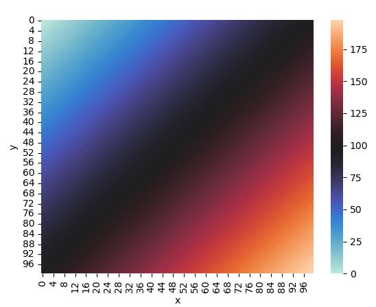
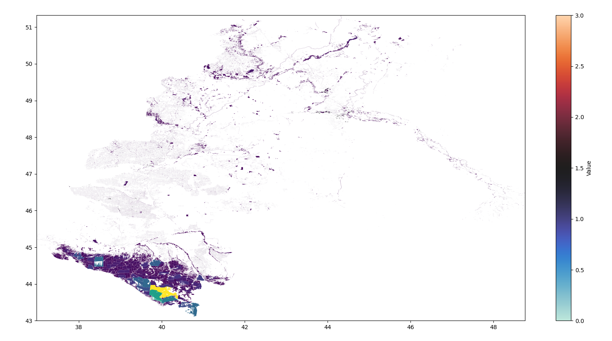

# Energy distribution calculator

EDC - это Python библиотека, предназначенная для расчёта энергетического потенциала региона

## Зависимости

Используйте пакетный менеджер [pip](https://pip.pypa.io/en/stable/) для установки необходимых зависимостей

```bash
pip install -r requirements.txt
```

При необходимости используйте виртуальное окружение

## Использование

Пример расчёта распределения энергии для коровьего навоза:

```python
from edc.energy_source.cow_dung_energy_source import CowDungEnergySource

# Выбор источика энергии
energy_source = CowDungEnergySource()

# Расчёт распределения энергии для выбранного источника энергии.
# Для всех источников используется один и тот же метод.
# path - путь до каталога с необходимыми для расчёта данными
map = energy_source.calculateEnergyGenerationDistribution(path="data")

# Вывод результата
map.draw()
```

Пример вывода для этого источника энергии:

```
Российская Федерация:    754.3 ПДж
Южный федеральный округ: 111.4 ПДж
Республика Адыгея:         2.4 ПДж
Республика Калмыкия:      21.0 ПДж
Республика Крым:           4.3 ПДж
Краснодарский край:       21.0 ПДж
Астраханская область:     15.3 ПДж
Волгоградская область:    18.0 ПДж
Ростовская область:       29.2 ПДж
г. Севастополь:           49.0 ТДж
```

## Входные данные
- data/ - путь для входных данных. При желании можно указать любой другой
- data/osm/ - тут могут храниться данные, полученные из OpenStreetMap: https://www.openstreetmap.org/, https://download.geofabrik.de/
- data/number_of_cows.json - поголовье коров по данным Росстат на 1 октября 2023 года
- data/properties.json - прочие данные для оценки энергии, получаемой из коровьего навоза

## Поддерживаемые форматы
- txt
- json
- shp (OpenStreetMap): каждому полигону в соответствие ставится его площадь, вычисляемая на эллипсоиде

## Источники энергии
- Коровий навоз: навоз перерабатывается в метан и сгорает. Оценивается количество вырабатываемой энергии за год. Данные представлены в [международной системе единиц (СИ)](https://ru.wikipedia.org/wiki/Международная_система_единиц)
- Солнце и ветер: добавлены как примеры других источников энергии в целях демонстрации расширения возможностей программы
- ExampleOfRasterDistributionEnergySource - демонстрация вывода распределения энергии в растровом формате

## Вывод данных
Данные могут быть выведены в консоль:
- в сыром виде,
- в формате ключ-значение.

Также возможен вывод растровых и векторных данных. Используется [matplotlib](https://github.com/matplotlib/matplotlib) и другие библиотеки

Пример вывода растровых данных:


Пример вывода векторных данных (леса в Южном федеральном округе согласно OpenStreetMap); чем ярче цвет - тем больше площадь полигона:



# Методика расчёта для демонстрационного примера с получением энергии из коровьего навоза

Поголовье коров по данным Росстат на 1 октября 2023 года:
```
  Российская Федерация                7.7 млн
  Южный федеральный округ          1136.8 тыс
  Республика Адыгея                  24.6 тыс
  Республика Калмыкия               214.7 тыс
  Республика Крым                    44.2 тыс
  Краснодарский край                214.4 тыс
  Астраханская область              156.2 тыс
  Волгоградская область             184.2 тыс
  Ростовская область                298.1 тыс
  г. Севастополь                      0.5 тыс
```
Эти данные представлены в data/number_of_cows.json

Условно (для реальных данных может отличаться):
```
Корова массой 450 кг
Производит 8% от массы коровы навоза в сутки = 36 кг
Выход биогаза на кг навоза: 0.4 м^3
Содержание метана в биогазе 65%
Плотность метана 0.714 кг/м^3
Удельная теплота сгорания метана 50.2 МДж / кг.
При сгорании метана остаётся 80% полезной энергии (тепло)
```
Эти данные представлены в data/properties.json

#### Имеем:
- 13 т. навоза в год на одну корову

На одну корову в сутки:
- Количество биогаза в сутки 14.4 м^3
- Объём метана в сутки 9.36 м^3
- Масса метана 6.7 кг
- Энергия, выделяемая при сгорании метана 335.5 МДж
- С учётом потерь, полезная энергия: 270 МДж

Количество полезной энергии в год:  
- На одну корову 98 ГДж
- На всех коров в Республике Адыгея 2410 ТДж

Если всю эту теплоту преобразовать в электроэнергию с КПД 40% получим
- 268 млн кВт*ч электроэнергии в год

Для сравнения:
- Мощность [Майкопской ГЭС](https://ru.wikipedia.org/wiki/Майкопская_ГЭС) — 9,4 МВт
- Среднегодовая выработка — 48,4 млн кВт·ч.

Стоит отметить, что производстводственный цикл также требует энергии, например, на перемещение навоза. Также могут быть значительные потери при перемещении тепла потребителям. Потому реальные значения могут значительно отличаться от теоретических и зависят от конкретной ситуации

Реализация расчётов находится в edc/energy_source/cow_dung_energy_source.py

## Добавление новых возможностей
Программа позволяет легко добавлять удобные ползователю форматы ввода и вывода данных, новые источники энергии

Для добавления нового источника энергии:
- Создайте новый модуль в папке edc/energy_source/
- Реализуйте класс с методом calculateEnergyGenerationDistribution, который возвращает объект распределения энергии.
 - Добавьте новый модуль в список поддерживаемых источников в основной программе.